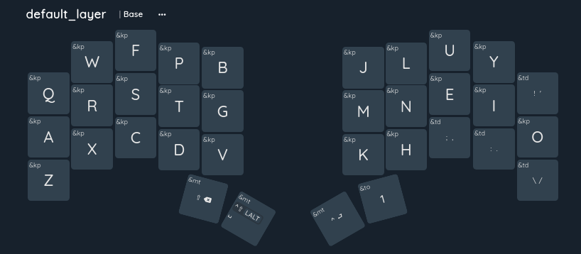

# My Custom Keyboard

Welcome to the repository for my custom keyboard layout configuration, powered by ZMK firmware! This repository holds all the necessary files to define the behavior and layout of my keyboard.

## About My Configuration

This configuration is tailored specifically to my preferences and needs, implemented on the [SplitKB Aurora Sweep](https://splitkb.com/products/aurora-sweep) keyboard design with the Colemak-DH layout. It includes custom keymaps, layers, macros, and other settings to optimize my typing and workflow experience.

## Partslist

| Number | Part    | Description |
| -------- | ------- |------- |
| 1 set | [SplitKB Aurora Sweep](https://splitkb.com/products/aurora-sweep) | Base PCB kit with diodes, resistors and Kailh hotswap sockets |
| 2 x   | NiceNano clones | Because this is my first build I used clones with the idea to swap them later |
| 2 x   | USB Cables      | Right from the start I knew I wanted magnetic USB cables for easy removing of the cables when not in use |
| 35 x  | Kailh Low profile choc browns | This being my first mechanical keyboard I didn't knew what I wanted I based my choice on a keyboard from a co-worker |
| 12 x  | 5050 LED's | I bought a bunch of LED's SK6812 WS2812B only 6 per board are needed for the underglow |
| 34 x  | SK6812 LED's | Again just bought a rol of about 50 these can be used to add RGB backlighting |
| 34 x  | Keycaps | I opted for [FKCaps keycaps](https://fkcaps.com/) in the MBK style |

## Keymaps

| Code | Function | Descripsion |
| -----|----------|-------------|
| &td  | TapDance | First key on longer tap, second key on short tap |
| &mt  | ModTap   | Modifier on longer tap, second key on short tap |
| &kp  | KeyPress   | Press selected key |

There are several layers to start with the Base layer

This layer holds the alpha keys and some punctuation
The 4 thumbkeys are 

| Left inner | Left outer | Right outer | Right inner |
|------------|------------|-------------|-------------|
| Hold SHIFT | Hold MEH * | Hold CTRL   | To LAYER 2  |
| tap backspace | Tap Space | Tap ENTER |             |

All keys can be used with the shift key.
The , (comma) and . (dot) keys
